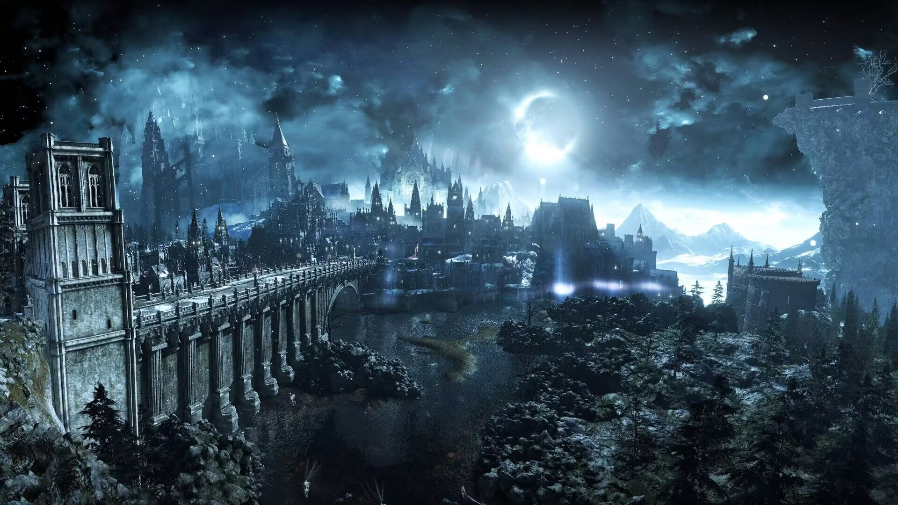

![][github-sub-title:img]

### 🧠 Technologies & Tools

---

### 📊 GitHub Stats

---

### 🌐 Where to find me

[[github-sub-title:img]: https://readme-typing-svg.herokuapp.com?font=Segoe+Script&center=true&lines=Hi!+I'm+Haibabara;A+Passionate+C%2B%2B+Developer;From+China]
